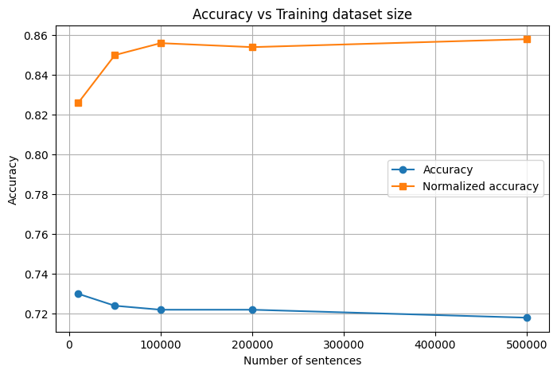

# Report

The task was to train three different language models (1-gram, 2-gram, and 3-gram).
I used Ukrainian Wikipedia corpus as a training dataset.

```
./
├── images/                 # Charts and visualizations
├── models/                 # Trained LMs (skipped due to git size limitations)
├── data/                   # Datasets
│   └── ua_asr_hypotheses_500.jsonl  # ASR candidates for rescoring
├── run.ipynb               # Jupyter Notebook with all experiments and code
└── README.md               # Project report
```

Several technical challenges I faced:

- **Compiling KenLM on macOS:** The standard build process failed because `cmake` could not find the Boost libraries (specifically `boost_system`), which is a known issue on Apple Silicon with newer Boost versions. I had to manually patch `CMakeLists.txt` to remove the unnecessary dependency on `system` and `unit_test_framework

- **Memory constraints:** I could not use the full dataset because processing millions of sentences caused memory issues in the notebook environment, so limited the training set to 500k sentences maximum

- **1-gram model limitation:** KenLM's Python library refuses to load "pure" 1-gram models, throwing an error that it "assumes at least a bigram model" I solved this by adding a fake 2-gram entry to the ARPA file so the model would load while still mathematically functioning as a 1-gram model

- **Text normalization:** The exact string matching accuracy was misleadingly low because the ASR output often had different spacing around punctuation (e.g. `word-word` vs `word - word`). I implemented a normalization function that ignores punctuation and extra spaces to evaluate the true word error rate

## 2. Results

To validate the approach I started with 25k sample of the dataset:

| Model | Exact accuracy | Normalized accuracy |
|-------|----------------|---------------------|
| 1-gram | 63.80% | 77.40% |
| 2-gram | 72.80% | 84.80% |
| 3-gram | 72.60% | 84.80% |

*Note: "Exact accuracy" checks for a perfect character-by-character match. "Normalized accuracy" ignores spaces and punctuation differences (e.g "Дніпро-1" vs "Дніпро - 1").*

The biggest jump in quality happened between the 1-gram and 2-gram models. This makes sense because the 1-gram model only looks at individual word probabilities, while the 2-gram model understands which words usually go together in context.
Moving from 2-gram to 3-gram gave a very small improvement. This is likely because my training Wikipedia dataset is different from the test data (News headlines), so many 3-word combinations from the test set were never seen during training.

## 3. Dataset size experiments

I trained the 3-gram model on different amounts of data to see if more text leads to better results: 10k, 50k, 100k, 200k, 500k sentences.




Surprisingly, increasing the dataset size did not improve the *Exact accuracy*. In fact, it slightly dropped. However *Normalized accuracy* (which is more important for real-world use) slowly increased from 82.6% to 85.8%.

This suggests that having *more* data helps the model choose the right words, but it might also introduce more variability in punctuation or formatting which hurts the exact match score. Also since I used Wikipedia for training but tested on news headlines, simply adding more Wikipedia articles didn't fix the domain mismatch problem

## 4. Error analysis

### Why the model works
The language model is very good at fixing non-existent or rare words. For example, it correctly prefers "березня" over "перезня" because "березня" is a common word in the corpus, while "перезня" is likely never seen.

It also handles standard phrases well. If ASR suggests "political party" vs "political potty", the LM will easily pick "party" because "political party" is a high-probability bigram.

### Where it fails
Even the best 3-gram model made 76 hard errors (out of 500). Here are the common types:

**1. Stuttering / repetitions**
*   *Ref:* `Відео голу Козака`
*   *Sel:* `Відео Відео голу Козака`
*   *Ref:* `вона`
*   *Sel:* `вона вона`

**Why:** The model prefers common words. If a word like "video" is very frequent, repeating it might not penalize the score enough to override the ASR's confidence in that output

**2. Semantic inversion**
*   *Ref:* `Ми не розслабилися`
*   *Sel:* `Ми ж розслабилися`
*   *Ref:* `не погодилась тільки Мексика`
*   *Sel:* `погодилась тільки Мексика`

**Why:** Small function words like "не" or "ж" are short and can be easily missed by ASR. The LM might calculate that "Mexica agreed" is a perfectly valid sentence grammatically, so it doesnt rescue the missing "not"

**3. Proper names**
*   *Ref:* `в літаку додивлявся`
*   *Sel:* `в літаку дотивлявся`
*   *Ref:* `"ІД"`
*   *Sel:* `" ИД "`

**Why:** The model was trained on Wikipedia which uses standard Ukrainian. The test set contains colloquial speech, slang, or specific proper names (like "ИД" possibly from a Russian source). If the LM hasn't seen the word "додивлявся" often, it cannot confidently correct the similar-sounding error "дотивлявся"

## Conclusion
A classical N-gram model is a fast and effective baseline for ASR rescoring. It fixes most spelling and word-choice errors (85% accuracy). However it struggles with:
- Punctuation/formatting (spaces around hyphens)
- Contexts that require understanding meaning, not just word probability
- Domain-specific words that weren't in the training data
