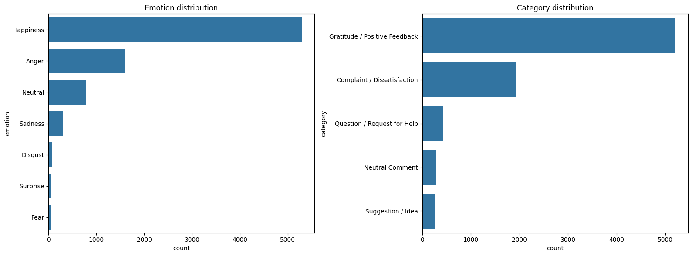
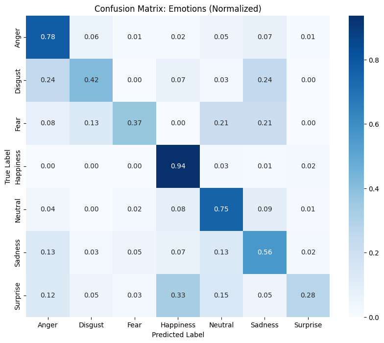
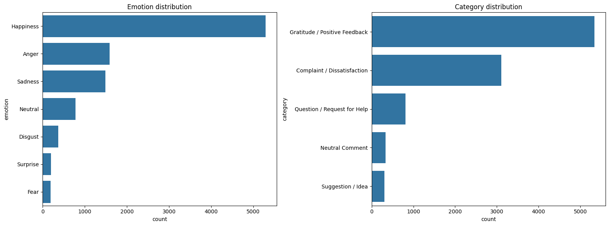

# Ukrainian emotions classification (NLP Course competition)

**Author**: Mark Matviiv, PKN24/M\
2025, UCU

## Overview
This is a report of the [Ukrainian emotions classification task](https://www.kaggle.com/competitions/ucu-ukrainian-emotions/overview).

The goal of the task is to classify short Ukrainian reviews by categories and emotions. Solution should be based on NN and not use APIs. Evaluation metric is Macro F1 averaged across tasks (columns).

Files:
- [`train.csv`](./train.csv): dataset for training
- [`test.csv`](./test.csv): competition dataset
- [`submission.csv`](./submission.csv): my submission file for the competition
- [`run.ipynb`](./run.ipynb): notebook with the solution
- [`models/`](./models/): directory for model training (empty cuz each fold is more than 1Gb)

## Approach #1

The main idea was to use a Bert-based model which is pre-trained on a large dataset of Ukrainian text. Then train a two-headed model to classify the reviews by categories and emotions.

I tried different models (xlm-roberta-base, youscan/ukr-roberta-base, etc.) expecting that the `ukr-roberta-base` will be the best model since it ukranian-specific model. However, the best results were achieved with the `microsoft/mdeberta-v3-base` which is multilingual model.

To achive the best results, I've used the K-Fold cross-validation with 5 folds.
For each fold, I've trained a model and saved the best model over all epochs.

### Challenges
The main problem was the class imbalance in the dataset.

The amount of samples for each class is far from equal.
Especially for the `Emotion` labels. That caused a lot of problems for the model to learn the `disgust`, `suprise`, `fear` classes.

I tried a lot of optimization techniques and tricks to improve the results for them. For instance, I used the Focal Loss and weights smoothing for slightly compensating the imbalance.

The average F1 scores I got were:

| Metric | Emotion | Category | Overall |
|--------|---------|----------|---------|
| F1     | 0.56    | 0.80     | 0.68    |

Which was pretty good taking into account the class imbalance. The high category score compensates a bit the low emotion one.

On the Kaggle competition page, the score was **0.65**.

## Approach #2

Then I decided to try two more techniques to improve the results:
1. Data augmentation for rare classes
2. More powerful base model for better performance

### Data augmentation
Since using any kind of API was forbidden, I could not use LLM to generate more data which would provide the best quality of it.

So I've decided to use the simple forward and backward translation in intermediate languages. That provided at least some variety of data for the rare classes keeping the original logic of the dataset.

To achive that, the `Helsinki-NLP/opus-mt` models were used.

### More powerful base model
Exploring the other available ukrainian BERT models, I've found a pretty cool one - [Goader/modern-liberta-large](https://huggingface.co/Goader/modern-liberta-large)

Which seems to be the newest and the most powerful in terms of "understanding" the ukrainian language which is critical for such a tough task as emotions classification.

And that worked, the average F1 scores for emotions immediately jumped from **0.56** to **0.83**.

## Results

Combining both approaches, I've managed to achieve **0.85** locally as the final score:

| Metric | Emotion | Category | Overall |
|--------|---------|----------|---------|
| F1     | 0.83    | 0.87     | 0.85    |
